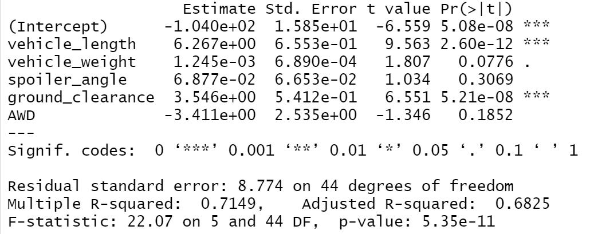
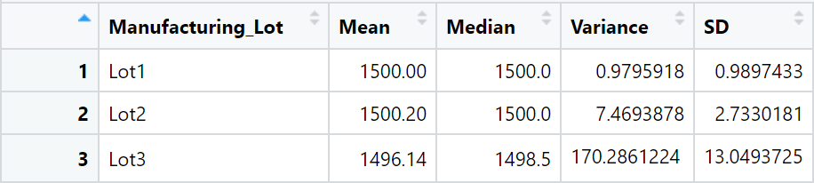
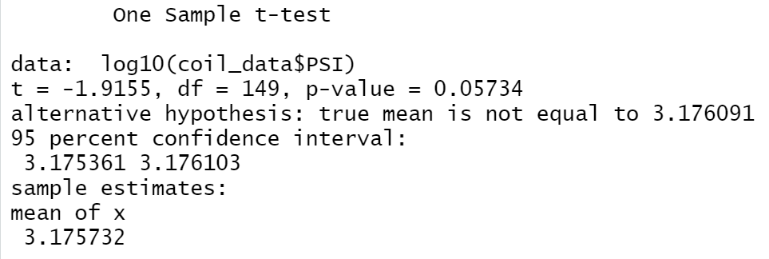
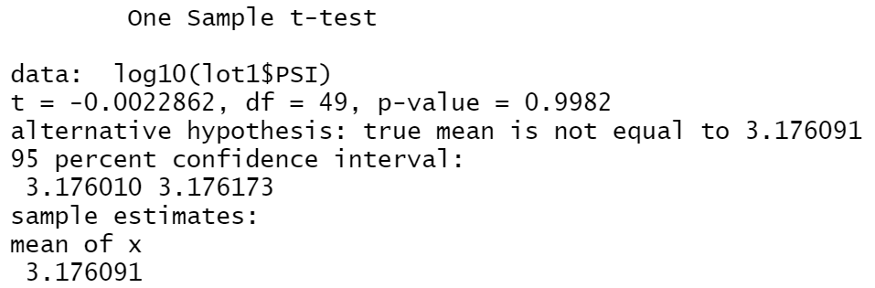
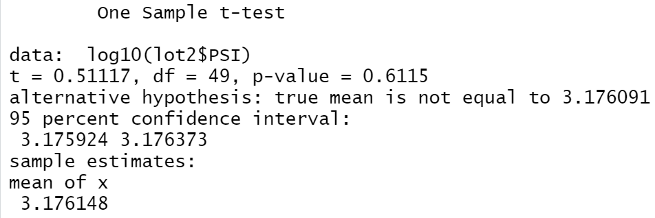
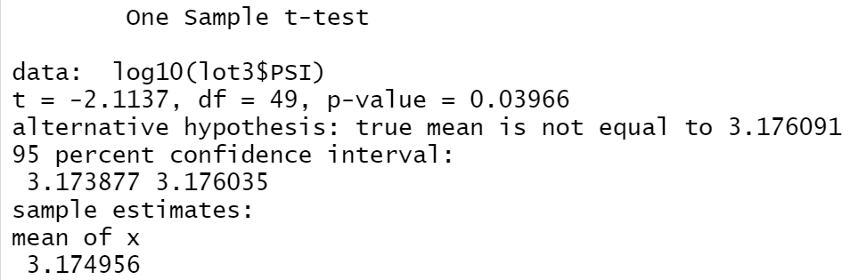

# MechaCar_Statistical_Analysis
---
## Linear Regression to Predict MPG

1. According to the multiple regression analysis performed in R, the following variables contributed a statistically non-random amount of variance to the mpg values in the dataset:
  * Intercept
  * Vehicle Length
  * Ground Clearance

2. As evidenced by the p-value displayed above, the slope of the linear model can be considered to not be zero. Since the p-value is well below the (presumed) 0.05 threshold ... it can be statistically/reasonably concluded that the null hypothesis, which is--the slope of the linear model is zero and thereby thereby no statistically significant correlation exists between any of the points--can be rejected. 

3. In my opinion, this linear model does not predict mpg of MechaCar prototypes effectively because the intercept term explains a significant amount of variability in the dependent variable when all independent variables are equal to zero. Therefore, this could mean that the other significant variables (vehicle length and ground clearance) need scaling or transforming to help increase the predictive power of the model. Another possibility is that there are other independent variables that are significantly contributing to the variability of the dependent variable that are not included in this model. 
---
## Summary Statistics on Suspension Coils

---

* I believe the current manufacturing data presents that the design specification which states, "The variance of the suspension coils must not exceed 100 pounds per square inch", is being met for all manufacturing lots in total, but only for 'Lot1' and 'Lot2' when analyzed individually because the average variance across all lots is only ~1.79 lbs per square inch. However, 'Lot3' has a variance of ~170.29 lbs per square inch, clearly exceeding the design specification. 
---
## T-Tests on Suspension Coils
### Across All Lots - Population

* As shown above, the p-value--when computing a one-sample t-test between the lbs./PSI across all lots and the population mean of 1500 lbs./PSI--is slightly above our 0.05 threshold. Therfore, we have failed to reject the null hypothesis. Meaning, we cannot statistically conclude that the population mean is different from the sample mean.

### Lot1 - Population

* The above image shows that when a one-sample t-test was performed bewteen the mean of all Lot1 vehicles' lbs./PSI and the population mean of 1500 lbs./PSI, the p-value is well above our 0.05 threshold. Therefore, we cannot statistically conclude that the population mean is different from the sample mean.

### Lot2 - Population

* When a one-sample t-test was conducted amongst the mean of all Lot2 vehicles' lbs./PSI and the population mean of 1500 lbs./PSI, again the p-value exceeds the 0.05 threshold. Therefore, we cannot statistically reject the null hypothesis.

### Lot3 - Population 

* The above results show that when a one-sample t-test was conducted amongst the mean of all Lot3 vehicles' lbs./PSI and the population mean of 1500 lbs./PSI, the p-value does not exceed the 0.05 threshold. Therefore, we can statistically reject the null hypothesis. 
---
## Study Design: MechaCar vs Competition
* A statistical study that can quantify how the MechaCar performs against the competition would include the following metrics that would be of interest to consumers:
  1. City Fuel Efficiency
  2. Highway Fuel Efficiency
  3. Horsepower
  4. Break Control (Avg. time it takes car to completely stop from travelling 100 km/h)
  5. Longevity (Average lifespan of car defined by average km. driven before owner purchases new primary vehicle --> other assumptions will likely need to be met for this metric to be of use to consumers) 
 * The null hypothesis would be that the above metric means for the MechaCar do not statistically differ from the population metric means (The mean of each metric across all competition)
 * To test this hypothesis, I would first use a multiple regression analysis using historical data to collect the required data for each metric (after taking all necessary steps to ensure the data complies with any of this statistical test's assumptions and that the test's results are statistically valid) so that as many one-sample t-tests can be computed to reveal if our null hypothesis can be statistically rejected. 
 * Historical data across all of the above metrics, as well as the data produced by the multiple regression analysis would be needed to run the statistical test.
